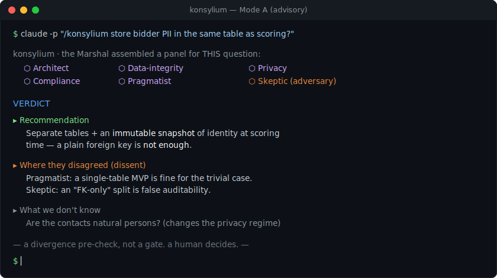

# konsylium

> **A panel of AI advisors instead of one confident answer.** One command convenes 3–6 advisors who judge your decision from different angles — independently — then return a single verdict that shows exactly where they disagreed and what's still unknown.
>
> *Multi-perspective AI council for Claude Code, Codex & the Claude app. One command · blind panel · honest dissent — a pre-check, never a gate.*
>
> 🇵🇱 [Wersja polska](README.pl.md)




<details>
<summary><b>Contents</b></summary>

- [Quick start](#quick-start)
- [See an example](#see-an-example)
- [Why?](#why)
- [How it works](#how-it-works)
- [Is this for you?](#is-this-for-you)
- [Install](#install)
- [Also from the terminal](#also-from-the-terminal)
- [Privacy & safety](#privacy--safety)
- [Honestly: what it does NOT do](#honestly-what-it-does-not-do)
- [Does it actually work?](#does-it-actually-work)
- [What it builds on (credits)](#what-it-builds-on-credits)
- [Contributing & license](#contributing--license)

</details>

## Quick start

```sh
git clone https://github.com/witczakm/konsylium.git && cd konsylium
sh install.sh                  # preview without changes: add --dry-run
```

Then, in a **new Claude Code session**, ask a real question — e.g.:

```
/konsylium monolith or microservices for a small team?
/konsylium raise prices 30% now, or wait?
/konsylium one table for customer data, or split it?
```

…or anything of your own: `/konsylium <your decision>`.

You get one verdict in a fixed shape:

```text
Recommendation: monolith — one team, one deploy; microservices add operational
  cost you won't earn back yet.
Where they differed: Architect vs Pragmatist — module boundaries (a value
  tension, not an error).
What we don't know: [TO CHECK] projected traffic and SLA targets.
Next step: record it as an ADR; if the call is irreversible → Mode B.
```

Codex and the desktop app are covered below.

## See an example

Someone asked how to design a database (where to keep customer data). Instead of a single answer,
konsylium assembled advisors for **privacy, compliance and data integrity** — and two of them
independently caught something a plain answer would miss:

> **Recommendation:** split the data into separate tables and store a "snapshot" of the data as it was
> at decision time — because a later name correction must not rewrite the history of an earlier decision.
> **Where they differed:** one advisor allowed a simpler start; another pushed back hard on it.
> **What we don't know:** whether these are personal data (then GDPR applies)…

Full verdict and three more decisions → **[examples/](examples/)**.

## Why?

The worst decisions look great — right up until it's too late. It's rarely bad code; it's building **the
wrong thing**. A second opinion would help, but who wants to hand-prompt three models and stitch the
answers together? konsylium does it in one command — and flags the weak spots **before** you walk into them.

## How it works

The rhythm is simple — one question **fans out** to several independent advisors and **comes back** as a
single verdict:

```
              Your question
                    │
                  Chair               → picks 3–6 advisors to fit the question
                    │
        ┌─────┬─────┼─────┬─────┐     ↓ FAN-OUT — each one alone (blind),
        ▼     ▼     ▼     ▼     ▼        in its own clean context
     architect skeptic data cost …
        └─────┴─────┼─────┴─────┘     ↑ FAN-IN — synthesis, no names
                    ▼
              Verdict
     recommendation · where they differed · what we don't know
                    │
                    ▼
              You decide
```

Step by step:

1. **Pick the panel.** A "chair" reads your question and assembles 3–6 advisors that actually fit it
   (e.g. an architect, a skeptic, a data specialist). There's always someone playing devil's advocate.
2. **Independent opinions.** Each advisor answers on their own, **without seeing the others** — so they
   don't copy or defer to one another.
3. **No names.** Opinions go into the summary anonymously, so the argument counts, not "who said it".
4. **The verdict.** You get one recommendation, a clear "where they differed", an honest "what we don't
   know", and a next step.

It's **a decision aid, not a verdict** — the final call is always yours.

### Two modes

| Mode | When | What you get |
|------|------|--------------|
| **A — advisory** (default) | most decisions | 3–6 advisors in one session, blind, one verdict — fast |
| **B — gate** | important / irreversible | routes to AI models from **different vendors** for genuine independence |

A panel from a single provider isn't the same as a second opinion from an independent one — so high-stakes calls escalate to Mode B.

## Is this for you?

✅ **Yes**, if: the decision is hard to reverse or costly · you're choosing between 2–3 options and it isn't obvious · you have an idea and want it honestly challenged · you're locking an important doc/plan and want other angles first.

❌ **Probably not**, if: the question is simple and obvious — one answer is plenty.

## Install

**What you need:** Claude Code or Codex (or the Claude app). The repo ships two language editions —
English and Polish; both register the `/konsylium` command.

```sh
sh install.sh --dry-run     # preview — writes nothing
sh install.sh               # install (English) into Claude Code + Codex
```

An existing install is backed up, never silently overwritten. Then start a new session.

<details>
<summary><b>Codex, the desktop app, the Polish edition</b></summary>

- **Polish edition:** `sh install.sh --lang pl`
- **One tool only:** add `--claude-only` or `--codex-only`
- **Claude / Cowork desktop app** (it imports a ZIP, it doesn't read the folders):
  Customize → Skills → **"+" → Create skill** → upload `dist/konsylium-en.zip` (or `-pl`) → toggle **ON**.

</details>

## Also from the terminal

You don't have to be in a chat — it works as a one-liner too (handy for automation, e.g. in CI):

```sh
claude -p "/konsylium one table to start, or split the data?"
codex exec "use the konsylium skill: monolith or microservices for a small team?"
```

Pipe the result to a file (`> verdict.md`) and drop it into your notes, a PR description, or a decision log.

## Privacy & safety

- **The skill itself sends nothing to the internet and collects no data** — it's plain text instructions;
  the only script (`install.sh`) just copies files locally.
- Anything reaches the cloud only when **you** deliberately use the "important decisions" mode.
- **Don't paste secrets or sensitive data** into a question.

Details and how to report issues → [SECURITY.md](SECURITY.md).

## Honestly: what it does NOT do

No miracle claims:

- **It's a thinking aid, not an oracle.** For a simple question, don't use it — one answer is enough.
- **The same question can give a slightly different panel and a different answer.** In regular mode that's
  on purpose — the point is varied angles (need repeatability? → the important-decisions mode).
- **Advisors can sound different yet think alike.** We make sure each looks from a different angle, but
  we don't measure that.
- **It costs a bit more than one question** (it runs several opinions at once). Use it for decisions that
  matter — still cheaper than building the wrong thing.
- **No endless arguing.** Research shows forcing AI through many rounds of debate doesn't improve quality
  (and sometimes hurts), so we keep it to one round.

## Does it actually work?

No promises that it always does. I ran a small, honest test on **5 real decisions**: it helped in **4**
(clearly once, moderately three times) and **not at all once** (simple questions don't need a panel).
Details: [EVALS.md](EVALS.md). Treat it as a way to get a broader view, not an infallible oracle.

## What it builds on (credits)

The "AI panel" idea isn't new — a nod to:
[karpathy/llm-council](https://github.com/karpathy/llm-council),
[council-review](https://github.com/ngmeyer/council-review),
[council-of-high-intelligence](https://github.com/0xNyk/council-of-high-intelligence),
[llm-consortium](https://github.com/irthomasthomas/llm-consortium),
Anthropic's [Agent Skills](https://github.com/anthropics/skills).

What konsylium adds: **a panel chosen for the question** (not a fixed roster), **one package across
several tools**, and a clear split between **"advising" and "independent scrutiny"**. The specific
borrowed ideas and their licenses are in [THIRD-PARTY-NOTICES.md](THIRD-PARTY-NOTICES.md).

<details>
<summary><b>For the technically curious</b></summary>

- It's a **skill** (Markdown instructions the AI runs) — not a server; nothing to launch or maintain.
- Each advisor runs in its **own clean context**; only the summary returns to the main conversation.
- Skills **don't sync across tools** — install separately in each (Claude Code, Codex, the app).
- The "important decisions" mode routes the question to a multi-model consensus tool (e.g.
  [`llm-consortium`](https://github.com/irthomasthomas/llm-consortium)) so a *different* model evaluates
  than the one that generated — and always before, never instead of, the human's call.

</details>

## Contributing & license

PRs welcome — see [CONTRIBUTING.md](CONTRIBUTING.md). History: [CHANGELOG.md](CHANGELOG.md).

MIT © 2026 Michał Witczak. Use it freely.
